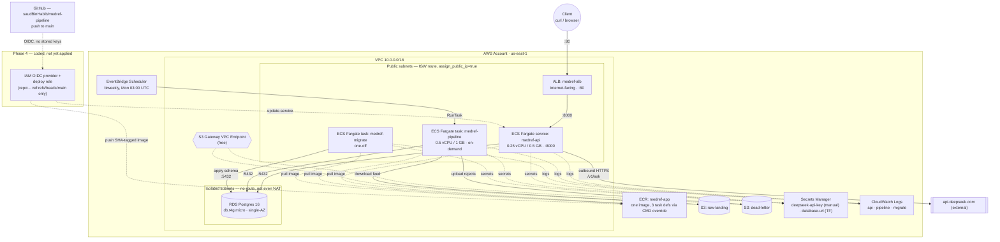

# AWS Deployment Plan — medref-pipeline

Deploys the dockerized `medref-pipeline` API + batch pipeline to AWS as a
cost-conscious demo environment. This document is the source of truth for
the `task-planner`, `infra-engineer`, and `infra-reviewer` subagents — it
fixes every architectural decision so none of them have to guess.

## Global parameters

| Parameter | Value |
|---|---|
| AWS region | `us-east-1` |
| Project prefix | `medref` |
| GitHub repo | `saudBinHabib/medref-pipeline` |
| Terraform version | `>= 1.6` |
| AWS provider version | `~> 5.0` |
| Pipeline schedule | every other Monday, 03:00 UTC (EventBridge Scheduler, `cron(0 3 ? * 2#2,4#2 *)`-equivalent — see Phase 3 notes on biweekly cron) |
| Environment | single environment, `demo` — no staging/prod split |

**Non-goals (explicitly out of scope for this deployment):** HTTPS/custom
domain, Multi-AZ RDS, autoscaling, WAF, VPC Flow Logs, multi-environment
promotion. This is a cheap, tear-down-able demo, not a production topology.

---

## Architecture

### Infrastructure diagram

Reflects the actual Terraform generated across all 8 modules. Phases 0-3
(everything except `cicd`) are applied and live; **`cicd` is coded but not
yet applied** — marked dashed below.



**The security boundary that makes "public subnet, no NAT" safe:**
`alb_sg` (80 from `0.0.0.0/0`) → `ecs_sg` (8000 from `alb_sg` only, never the
internet) → `rds_sg` (5432 from `ecs_sg` only). Tasks having public IPs is
irrelevant to actual exposure — the security groups are the real control.

### Networking

One VPC (`10.0.0.0/16`) across two AZs (`us-east-1a`, `us-east-1b`):

| Subnet | CIDR | AZ | Route | Purpose |
|---|---|---|---|---|
| `public-a` | `10.0.0.0/24` | a | → IGW | ALB, ECS tasks |
| `public-b` | `10.0.1.0/24` | b | → IGW | ALB, ECS tasks |
| `isolated-a` | `10.0.10.0/24` | a | none | RDS |
| `isolated-b` | `10.0.11.0/24` | b | none | RDS |

**No NAT Gateway.** `/v1/ask` calls `api.deepseek.com` — a real external
internet destination that a private-subnet-plus-VPC-endpoints design
cannot reach at all (endpoints only cover AWS service APIs). Instead, ECS
tasks (API and pipeline) run in the **public** subnets with
`assign_public_ip = true`, and a security group is the actual control:

- `alb_sg`: ingress 80/tcp from `0.0.0.0/0`
- `ecs_sg`: ingress 8000/tcp from `alb_sg` only (never from `0.0.0.0/0`)
- `rds_sg`: ingress 5432/tcp from `ecs_sg` only

RDS sits in the **isolated** subnets (no route to anything, not even NAT)
— it never needs outbound internet, so isolating it is free and strictly
more secure than a public subnet would be.

One **S3 Gateway endpoint** (free, route-table-based, no ENI/hourly cost)
is attached so the pipeline's S3 traffic to `raw-landing`/`dead-letter`
doesn't need to leave over the public route. No paid interface endpoints
are used anywhere in this design.

### Compute

- **ECS Fargate** cluster, one cluster for both services.
- **API service**: task def `medref-api`, default container CMD (the
  Dockerfile's existing `uvicorn src.api.main:app` entrypoint), 0.25 vCPU
  / 0.5 GB, behind an ALB (HTTP:80 → target group 8000), desired count 1,
  CloudWatch log group with 7-day retention.
- **Pipeline task**: task def `medref-pipeline`, same image, CMD
  overridden to `python -m src.pipeline --feed <s3-sourced-file>`, 0.5
  vCPU / 1 GB, triggered on a schedule (not a long-running service).
- **Migration task**: task def `medref-migrate`, same image, CMD
  overridden to `psql "$DATABASE_URL" -f migrations/001_init.sql`, run
  once manually via `aws ecs run-task` after Phase 1, and again any time
  the schema changes.

All three task defs share **one ECR image** — see Dockerfile changes
below — selected by CMD override, not three separate images.

### Data

- **RDS**: `db.t4g.micro`, Postgres 16, single-AZ, 20 GB gp3,
  `publicly_accessible = false`, master password generated by Terraform's
  `random_password` and stored in Secrets Manager (never hardcoded,
  never in a variable default).
- **S3**: `medref-raw-landing-<account_id>` and
  `medref-dead-letter-<account_id>` (account-id suffix for global
  uniqueness), public access blocked on both, versioning off (demo).

### Secrets

Two Secrets Manager entries:

1. `medref/deepseek-api-key` — **created by you via AWS CLI before Phase
   1**, not by Terraform:
   ```bash
   aws secretsmanager create-secret \
     --name medref/deepseek-api-key \
     --secret-string "sk-..." \
     --region us-east-1
   ```
   Terraform's `secrets` module only reads this by name/ARN
   (`data "aws_secretsmanager_secret"`) — the value never enters a `.tf`
   file, a variable default, or Terraform state as a managed resource.
2. `medref/database-url` — created **by** Terraform, value assembled from
   the RDS module's outputs + the `random_password` result. This is fine
   to manage in Terraform because nothing is hardcoded; it's generated at
   apply time.

The ECS task execution role gets an IAM policy scoped to exactly these
two secret ARNs (no wildcard `secretsmanager:*`), and both are injected
into the containers via the task definition's `secrets` block — never as
plain `environment` entries, never baked into the image.

### CI/CD

GitHub Actions OIDC — no stored AWS access keys anywhere:

- OIDC provider: `token.actions.githubusercontent.com`
- Deploy role trust policy scoped to
  `repo:saudBinHabib/medref-pipeline:ref:refs/heads/main` (push-to-main
  only, not every branch/PR)
- Deploy role permissions (least privilege, not `AdministratorAccess`):
  - `ecr:GetAuthorizationToken` (all resources, required by the API)
  - `ecr:BatchCheckLayerAvailability`, `PutImage`, `InitiateLayerUpload`,
    `UploadLayerPart`, `CompleteLayerUpload` scoped to the one `medref-app`
    repo ARN
  - `ecs:DescribeServices`, `UpdateService`, `RegisterTaskDefinition`,
    `DescribeTaskDefinition` scoped to the `medref-cluster` /
    `medref-api` service ARNs
  - `iam:PassRole` scoped to just the two task role ARNs (execution role,
    task role) — not `*`
- Workflow (`.github/workflows/deploy.yml`), triggered on push to `main`:
  1. checkout
  2. `aws-actions/configure-aws-credentials` via OIDC (`role-to-assume`,
     no `aws-access-key-id`)
  3. `docker build` + push to ECR tagged with the git SHA (immutable tag,
     never `:latest`)
  4. render a new task definition revision with the new image tag,
     `ecs update-service --force-new-deployment`
  5. `aws ecs wait services-stable`

**Bootstrapping note:** before Phase 4 exists, ECS has no image to run
in Phase 2. You build and push an initial image manually right after
Phase 0:
```bash
aws ecr get-login-password --region us-east-1 | docker login --username AWS --password-stdin <account_id>.dkr.ecr.us-east-1.amazonaws.com
docker build -t <account_id>.dkr.ecr.us-east-1.amazonaws.com/medref-app:bootstrap .
docker push <account_id>.dkr.ecr.us-east-1.amazonaws.com/medref-app:bootstrap
```
Task definitions take `image_tag` as a required Terraform variable (no
default) — Phase 2/3 applies pass `-var="image_tag=bootstrap"` until
Phase 4's CI pipeline starts producing real SHA tags.

### Dockerfile changes required

Current `Dockerfile` only supports the API. It needs, for the migration
task:
```dockerfile
RUN apt-get update && apt-get install -y --no-install-recommends postgresql-client \
    && rm -rf /var/lib/apt/lists/*
COPY migrations ./migrations
```
added before the existing `CMD`. One image now serves all three task
defs via CMD override — no second image/ECR repo needed.

---

## Module layout (`infra/modules/*`)

| Module | Resources |
|---|---|
| `network` | VPC, 4 subnets, IGW, route tables, S3 gateway endpoint, `alb_sg`/`ecs_sg`/`rds_sg` |
| `ecr` | `medref-app` repo, lifecycle policy expiring untagged images after 14 days, `force_delete = true` |
| `rds` | DB subnet group (isolated subnets), `random_password`, `db.t4g.micro` Postgres 16 instance, `rds_sg` ingress rule |
| `s3` | `raw-landing` + `dead-letter` buckets, public access block, S3 gateway endpoint route association |
| `secrets` | `data.aws_secretsmanager_secret` for the pre-created DeepSeek key, `aws_secretsmanager_secret`/`secret_version` for the generated `DATABASE_URL`, IAM policy document for task execution role, both with `recovery_window_in_days = 0` |
| `ecs_api` | ECS cluster, `medref-api` task def, service, ALB, target group, HTTP listener, CloudWatch log group (7-day retention) |
| `ecs_pipeline` | `medref-pipeline` task def, `medref-migrate` task def, EventBridge Scheduler rule, IAM role for EventBridge → `ecs:RunTask` |
| `cicd` | OIDC provider, deploy IAM role + policy, does **not** write the workflow file itself — `infra-engineer` writes `.github/workflows/deploy.yml` directly (not a Terraform-managed resource) |

`infra/bootstrap/` is a separate, tiny root module (own local state,
applied once by hand) creating:
- S3 bucket `medref-tfstate-<account_id>` (versioned, encrypted)
- DynamoDB table `medref-tf-locks` (`LockID` string key, on-demand)

The main config's `backend "s3"` block points at these once they exist.

---

## Phased build order

### Phase 0 — Foundation
`infra/bootstrap` (state backend, applied first, separately) →
`network` + `ecr` modules.
**Resources created:** VPC, 4 subnets, IGW, 2 route tables, S3 gateway
endpoint, 3 security groups, 1 ECR repo.
**Manual step after this phase:** build & push the `bootstrap`-tagged
image (see CI/CD section above).

### Phase 1 — Data layer
`rds` + `s3` + `secrets` modules.
**Prerequisite manual step:** create `medref/deepseek-api-key` in
Secrets Manager via CLI (see Secrets section) *before* applying this
phase — the `secrets` module's data source will fail to resolve
otherwise.
**Resources created:** RDS instance + subnet group, 2 S3 buckets,
2 Secrets Manager secrets, IAM policy for secret access.

> **Migration task ordering:** the `medref-migrate` one-off task needs
> the ECS cluster from Phase 2 to run — it can't execute until Phase 2's
> `terraform apply` completes, even though it applies Phase 1's schema.
> `task-planner` should sequence actual `terraform apply` calls as
> Phase 0 → Phase 1 → Phase 2, then run the migration task
> (`aws ecs run-task ...`) immediately after Phase 2, before the API
> service takes any real traffic.

### Phase 2 — Compute (API)
`ecs_api` module.
**Resources created:** ECS cluster, `medref-api` task def + service, ALB
+ target group + listener, CloudWatch log group.
**Validation:** `curl http://<alb-dns-name>/health`.

### Phase 3 — Compute (pipeline)
`ecs_pipeline` module.
**Resources created:** `medref-pipeline` + `medref-migrate` task defs,
EventBridge Scheduler rule, IAM role.
**Validation:** manually trigger one pipeline run against a test file in
`raw-landing`, confirm rows loaded, dead-letter written, `pipeline_runs`
row recorded.

### Phase 4 — CI/CD
`cicd` module + `.github/workflows/deploy.yml`.
**Resources created:** OIDC provider, deploy IAM role + policy.
**Output to report:** the deploy role ARN, and what to set as a GitHub
repo variable (`AWS_DEPLOY_ROLE_ARN`, `AWS_REGION`, `ECR_REPOSITORY`,
`ECS_CLUSTER`, `ECS_SERVICE`) — none of these are secrets, so they're
repo **variables**, not GitHub secrets. `DEEPSEEK_API_KEY` never touches
GitHub at all — it lives only in AWS Secrets Manager.

### Phase 5 — Validation (no new Terraform)
Push a trivial change to `main`, watch the Actions run, confirm the new
SHA-tagged image lands in ECR and the ECS service rolls. Then full
end-to-end check: `/v1/medications` returns data, `/v1/ask` returns a
PZN-cited answer, a fresh `pipeline_runs` row exists.

---

## Cost estimate (us-east-1, if left running 24/7)

| Item | ~Monthly |
|---|---|
| ALB | $16–20 (the actual biggest fixed cost) |
| RDS `db.t4g.micro` + 20GB gp3 | ~$15 |
| API Fargate task (0.25 vCPU/0.5GB, 24/7) | ~$9 |
| Pipeline Fargate task (biweekly, minutes/run) | <$1 |
| Secrets Manager (2 secrets) | ~$0.80 |
| S3 + ECR storage | negligible at demo scale |
| **Total** | **~$45–55/mo** |
| NAT Gateway (avoided) | would have added ~$32–45/mo |

`terraform destroy` between sessions is the way to actually keep this
cheap — nothing here is designed to be left running unattended.

## Teardown notes

`terraform destroy` (run from the main config, after `bootstrap` is
separately handled) removes everything in Phases 0–4. It does **not**
remove:
- `infra/bootstrap`'s S3 state bucket + DynamoDB lock table (separate
  root module, separate lifecycle — destroy that directory explicitly,
  last, if you want it fully gone)
- Nothing else survives, by design: ECR (`force_delete = true`) and
  Secrets Manager (`recovery_window_in_days = 0`) are both configured to
  fully delete on destroy rather than soft-delete/retain.

## Explicit constraints for every generated module

- Never hardcode secrets, ARNs with account IDs baked in, or credentials
  in any `.tf` file — use `data.aws_caller_identity.current.account_id`
  and variables.
- Every resource tagged with `Project = "medref"`, `ManagedBy =
  "terraform"`.
- `terraform validate` must pass per-module; `terraform plan` must be
  clean (no errors) for the whole config before any apply is proposed.
- No `terraform apply` or `terraform destroy` runs without explicit,
  per-phase user approval in that turn.
