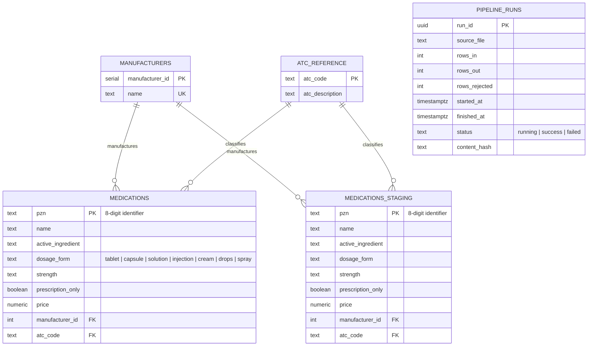

# medref-pipeline

A batch data pipeline and REST API for drug reference data. The pipeline ingests medication feeds (CSV), validates and enriches them with ATC classification codes, and loads them idempotently into PostgreSQL. A FastAPI service exposes the data via REST endpoints.

**Full specification:** see [SPEC.md](SPEC.md) (SPEC.md §1–11 for core architecture and acceptance criteria).

**Deploying to AWS:** see [AWS_Deployment_Plan.md](AWS_Deployment_Plan.md) for the architecture, and [infra/README.md](infra/README.md) for day-to-day start/stop/destroy operations.

---

## Data Model

Entity-relationship diagram of the schema defined in [`migrations/001_init.sql`](migrations/001_init.sql) (SPEC.md §3):



Notes:
- `medications_staging` mirrors `medications` column-for-column — the load stage writes there first, then atomically upserts into the serving table (SPEC.md §5.5, see [Staging + Upsert vs. Truncate + Replace](#staging--upsert-vs-truncate--replace) below).
- `pipeline_runs` is standalone lineage metadata (no foreign keys) — one row per pipeline execution, not joined against the other tables.

---

## Setup

### Option 1: Docker Compose (Recommended)

Copy the example environment file, then start Postgres and the API server with a single command. Migrations apply automatically via an init script:

```bash
cp .env.example .env
docker-compose up -d
```

Review `.env` and adjust values (e.g. `DEEPSEEK_API_KEY` if you want the optional `/v1/ask` endpoint) before or after starting the stack.

The API will be available at `http://localhost:8000` once the postgres service is healthy.

### Option 2: Local Development

If you prefer to run Postgres separately and develop locally:

1. Ensure Postgres 16 is running and accessible.

2. Install dependencies:
   ```bash
   pip install -e ".[dev]"
   ```

3. Apply migrations manually:
   ```bash
   psql "$DATABASE_URL" -f migrations/001_init.sql
   ```

4. Start the API server:
   ```bash
   uvicorn src.api.main:app --host 0.0.0.0 --port 8000
   ```

Set `DATABASE_URL` in your environment or `.env` file (see `.env.example`).

---

## Running the Pipeline

The pipeline ingests a CSV feed, validates each row, deduplicates on PZN, normalizes manufacturer references, enriches with ATC codes, and loads the result idempotently into the `medications` serving table.

Run a pipeline pass with:

```bash
python -m src.pipeline --feed data/feed_v1.csv
python -m src.pipeline --feed data/feed_v2_delta.csv
python -m src.pipeline --feed data/feed_broken.csv
```

**Output:**
- **Serving table:** `medications` — the clean, canonical medication records.
- **Dead-letter:** `dead_letter/<run_id>.csv` — rows rejected during ingestion (invalid schema, missing fields, etc.), with an added `rejection_reason` column.
- **Lineage:** `pipeline_runs` table — one row per pipeline run, recording `run_id`, `source_file`, `rows_in`, `rows_out`, `rows_rejected`, timestamps, `status` (`running` | `success` | `failed`), and `content_hash` — a stable, order-independent hash of *this run's* loaded batch (the `CleanRecord`s actually written to `medications` in that run, not a snapshot of the whole table). For a full feed this hash is stable across identical re-runs (useful for idempotency verification); for a delta feed it reflects only the delta loaded in that run, not the full serving-table contents. See `src/lineage.py::content_hash` and `tests/test_lineage.py`.

Example: after running all three feeds, query the lineage:
```bash
psql "$DATABASE_URL" -c "SELECT run_id, source_file, rows_in, rows_out, rows_rejected, status FROM pipeline_runs ORDER BY started_at DESC;"
```

---

## Regenerating Test Data

The synthetic medication and ATC reference data is generated once and committed. To regenerate:

```bash
python scripts/generate_data.py
```

This recreates:
- `data/feed_v1.csv` — initial full feed
- `data/feed_v2_delta.csv` — delta feed with new and updated PZNs
- `data/feed_broken.csv` — invalid rows for testing error handling
- `data/atc_reference.csv` — ATC codes and descriptions for enrichment

---

## API Endpoints

The API is available at `http://localhost:8000` (or configured via `API_PORT`). See the **interactive docs** at `/docs` (Swagger UI) or `/redoc` (ReDoc).

### Medications

**List medications** with optional filters:
```bash
curl "http://localhost:8000/v1/medications?dosage_form=tablet&limit=10"
curl "http://localhost:8000/v1/medications?prescription_only=true"
```

**Search medications** by name or active ingredient:
```bash
curl "http://localhost:8000/v1/medications/search?q=ibuprofen"
```

**Get a single medication** by PZN (8-digit identifier):
```bash
curl "http://localhost:8000/v1/medications/03041347"
```

### Statistics

**Dosage form distribution:**
```bash
curl "http://localhost:8000/v1/stats/dosage-forms"
```

### Health

**Check API and database connectivity:**
```bash
curl "http://localhost:8000/health"
```

All list endpoints support `limit` (1–500, default 50) and `offset` (default 0) for pagination. Responses include `total`, `limit`, and `offset`.

---

## Testing

The test suite uses **real Postgres integration tests** (not mocked), ensuring the full pipeline and API work end-to-end against an actual database.

### Run tests

With docker-compose (fastest):
```bash
docker-compose up -d postgres
pytest
```

This starts only the Postgres service and runs all tests against it.

### Why real Postgres, not mocks?

We test against a real database because:
1. **Idempotency guarantees** (e.g., upsert correctness) cannot be verified with mocks — they require the actual database to apply constraints.
2. **SQL correctness** depends on specific database behavior (e.g., parameterized query handling, transaction isolation).
3. **Integration bugs** (connection pooling, timeouts, transaction rollback) only surface with a real DB.

Mocking the database would pass false-positive tests and hide real failures in production.

---

## Design Decisions

### Stdlib CSV over Polars

We use Python's **stdlib `csv` module** (in `ingest.py`) rather than Polars or pandas. Reason: PZN (the medication identifier) is a fixed-length 8-digit string with leading zeros (e.g., `00012345`). Dataframe libraries can coerce such values to integers, losing leading zeros. Streaming CSV parsing preserves the string as-is and validates it explicitly in the schema layer.

### Staging + Upsert vs. Truncate + Replace

We load via a **staging table + upsert** (`INSERT ... ON CONFLICT DO UPDATE`) rather than truncating and replacing the entire `medications` table. Reason:

- **Delta feeds** (e.g., `feed_v2_delta.csv`) may contain only a subset of rows, not a complete snapshot.
- Truncate-and-replace would delete untouched rows from previous runs, losing data.
- Upsert semantics ensure new PZNs are inserted and existing ones are updated, while untouched rows remain.

### Idempotency

Idempotency (running the same feed twice yields identical contents) falls out of the upsert design:
- Each run inserts a new `pipeline_runs` row (new `run_id`).
- The upsert ensures each PZN appears exactly once in `medications`, with the latest values.
- A second run of the same feed updates each row to the same values, leaving `medications` unchanged.

Verified by `test_pipeline.py::test_running_same_feed_twice_is_idempotent`: running `feed_v1.csv` twice produces identical serving-table contents.

### Dead-Letter vs. Dedup: Different Failure Modes

**Dead-letter** and **dedup** handle different failure modes:

- **Dead-letter** (`ingest.py`): catches *schema violations* (missing fields, invalid types, PZN wrong length, bad `dosage_form`, negative price, etc.). These rows are written to `dead_letter/<run_id>.csv` with `rejection_reason`, and the pipeline continues with valid rows.

- **Dedup** (`transform.py`): catches *duplicates within a single feed* (two rows with the same PZN). The feed is assumed to come from a single, consistent source per run; duplicates suggest a source issue (e.g., a copy-paste error). We keep the last occurrence and proceed.

Example: `feed_broken.csv` includes a row pair with the same PZN but different `name`/`price` values. One is kept (the last), and the duplicate PZN is recorded in the deduplicate count.

### Enrichment Retry Wrapper: Dependency-Injected Fetch

The enrichment layer (`enrich.py`) includes a retry wrapper around ATC lookups. To keep this testable without external API calls:

- The `lookup_atc(code)` function is injected at test time, allowing tests to provide a mock.
- The retry logic (`exponential backoff + jitter + retry-after header`) is decoupled from the HTTP fetch via a `fetch_fn` parameter.
- Similarly, `sleep` is injected, so tests can verify retry behavior without waiting.

This design allows tests to run fast and reliably while the production code can point at a real terminology API (e.g., via a flag like `ATC_REMOTE_LOOKUP` in the config).

### API: Read-Only Core SQL (Not ORM)

The API (`src/api/main.py`) uses **SQLAlchemy Core** (`text()` and parameterized SQL) rather than the ORM (mapped classes). Reason:

- The API is **read-only** over a single table (`medications`).
- Core SQL is simpler to audit for correctness and security (no implicit joins, no N+1 queries).
- Parameterized queries prevent SQL injection while keeping the code transparent.
- ORM overhead is unnecessary for a read-only serving layer.

### Authentication: Out of Scope

Authentication is **out of scope** per SPEC.md §12. The API is designed for internal use or a trusted environment. If needed in the future, the extension point is straightforward: add a static API-key header dependency (e.g., `X-API-Key`) in the `dependencies` parameter of any route, with validation in a reusable `Depends()` function.

---

## Optional: `/v1/ask`

*Implement only after core acceptance criteria pass (SPEC.md §10).*

A `/v1/ask` endpoint (spec in SPEC.md §6.1) uses the DeepSeek API to answer natural-language questions about medications:

```bash
curl -X POST "http://localhost:8000/v1/ask" \
  -H "Content-Type: application/json" \
  -d '{"question": "What tablet medications treat hypertension?"}'
```

**Requirements:**
- Set `DEEPSEEK_API_KEY` environment variable with your DeepSeek API key (OpenAI-compatible chat completions API, model `deepseek-chat`).
- The endpoint retrieves relevant medication rows from `medications`, passes them to the DeepSeek API, and returns a natural-language answer citing the PZNs used.

We chose DeepSeek because it offers OpenAI-compatible chat completions and the project maintainer holds existing API credits there (not with Anthropic or other providers).

The endpoint is implemented in Task 10 of this plan and becomes available once the core pipeline and API are complete and tested.

---

## License & Development

See [SPEC.md](SPEC.md) for the complete project specification, data model, functional requirements, and acceptance criteria.
